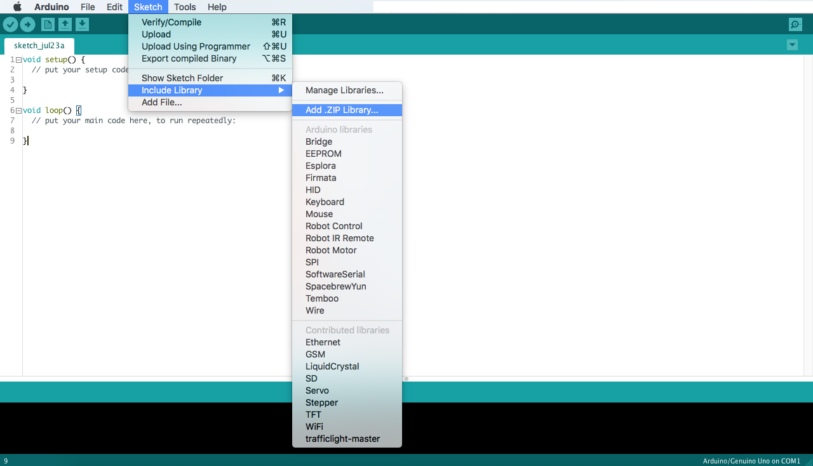
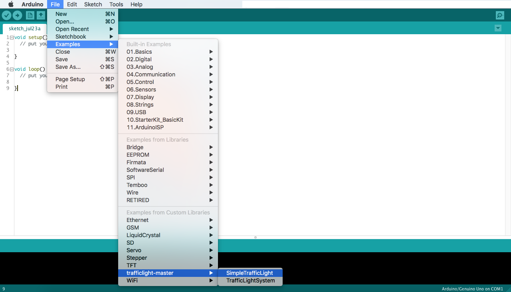

# arduino-trafficlight
Arduino Lirabry to work with TrafficLight in an object oriented way.

## How to use it ?
* Download the code as zip

* Add the library to your arduino IDE

* Use the code from the example folder

